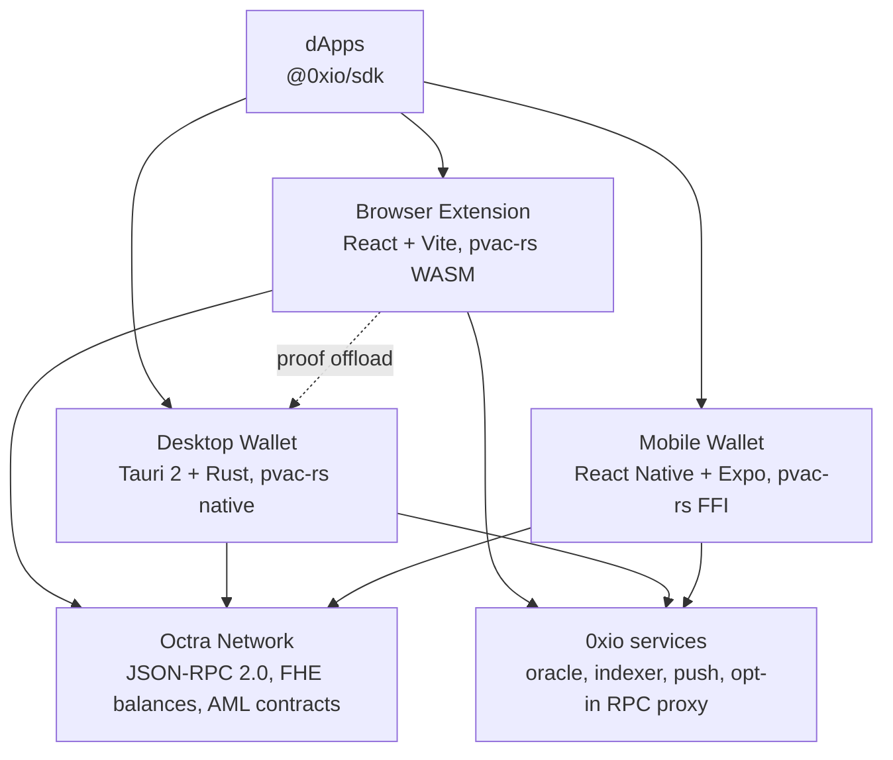

# 0xio

Privacy-first wallets for the Octra Network, built by **0xio Labs**.

**Install any 0xio client: [0xio.xyz/install](https://0xio.xyz/install)**

0xio covers a browser extension, a desktop app, a mobile app and developer tools, all built on one privacy stack: fully homomorphic encryption (FHE) for balances and transfers whose amounts stay encrypted on chain.

## Products

| Product | Status | Get it |
|---------|--------|--------|
| Browser Extension | Live, v2.5.5 (Chrome Web Store; Firefox in review) | [0xio.xyz/install](https://0xio.xyz/install) |
| Desktop Wallet | Live, v0.4.2 (macOS Apple Silicon, Windows; signed and notarized) | [0xio.xyz/install](https://0xio.xyz/install) |
| Mobile Wallet | v1.3.0 (iOS TestFlight, App Store release in review; Android Google Play open testing) | [0xio.xyz/install](https://0xio.xyz/install) |
| Developer SDK | Published, `@0xio/sdk` v2.8.1 | [npm](https://www.npmjs.com/package/@0xio/sdk) |
| PVAC SDK | Published, `@0xio/pvac` | [npm](https://www.npmjs.com/package/@0xio/pvac) |
| 0xio Bridge | Live, OCT and wOCT (Ethereum), any chain to OCT | [bridge.0xio.xyz](https://bridge.0xio.xyz) |
| 0xio DEX | Devnet, OCT and ETH cross-chain swap | [dex.0xio.xyz](https://dex.0xio.xyz) |
| 0xio Oracle | Live, OCT/USD price aggregation | oracle.0xio.xyz |
| Telegram Bot | Live, wallet monitoring | [@NullXio_bot](https://t.me/NullXio_bot) |

### Browser Extension

React 18 + Vite, Manifest V3, with a separate Firefox build. Privacy operations run in the browser through pvac-rs compiled to WebAssembly.

- Private balances: encrypt, decrypt, private sends and claims, with a claim budget that keeps every balance within its recoverable layer limit
- Vault: AES-GCM under a random vault key wrapped by the password (PBKDF2, 900,000 iterations); the unlocked session holds the vault key, never the password
- Required password on first run, optional passkey unlock (Touch ID, Windows Hello, security keys)
- One add-wallet flow: create with a backup check, import a phrase or a private key, watch an address, add accounts from a recovery phrase
- Sites bound to the wallet they connected with; network switches requested by a site need approval
- Domain-separated message signing, so a site cannot pass a transaction off as a message
- Your own node as a network; the 0xio RPC proxy is opt-in and never a fallback
- Tokens and NFT collections, with NFT and token transfers named in history
- Heavy proofs offload to 0xio Desktop when it runs
- English, Indonesian, Chinese, Japanese and Korean

### Desktop Wallet

Tauri 2 with a Rust backend and a React front end. pvac-rs runs natively, which makes it the fastest place to build privacy proofs, and it can accelerate the extension on the same machine.

- Full wallet: create, import, send, receive, private balance, claims, NFTs
- Contracts: deploy, call, call-view and verification, with FHE parameters
- Built-in browser for dApps and `oct://` circles
- Touch ID and Windows Hello
- Signed updates (minisign), served through 0xio.xyz

### Mobile Wallet

React Native 0.86 and Expo SDK 57. pvac-rs ships as native libraries (iOS static library, Android shared library).

- PIN and biometric unlock
- Private balance with the same rules as the extension and desktop
- dApp browser with tabs, and WalletConnect
- NFT gallery, address book, QR send and receive
- Push notifications
- Five languages

### Developer SDK

`@0xio/sdk` connects dApps to any 0xio wallet: connection, public and private transactions, balances, message signing, contract calls, finality tracking and typed events. Framework agnostic, full TypeScript types.

```bash
npm install @0xio/sdk
```

```typescript
import { createZeroXIOWallet } from '@0xio/sdk';

const wallet = await createZeroXIOWallet({
  appName: 'My DApp',
  autoConnect: true,
});

await wallet.connect();
```

`@0xio/pvac` ships the privacy primitives on their own (FHE encrypt and decrypt, range and bound proofs, cipher arithmetic, Pedersen commitments) as WASM that runs entirely client-side.

## Security and cryptography

### Keys

- **Mnemonic:** BIP39, 128-bit entropy from the Web Crypto API, 12 words.
- **Seed:** PBKDF2 with HMAC-SHA512, 2,048 iterations.
- **Master key:** `HMAC-SHA512("Octra seed", seed)[0:32]`, the same on every platform.
- **Signing:** Ed25519 (TweetNaCl).
- **Address:** SHA-256 of the public key, Base58, `oct` prefix, 47 characters.

### Privacy (PVAC)

PVAC is 0xio's privacy system on fully homomorphic encryption: encrypted balances that the chain can add without decrypting.

- **FHE encrypt and decrypt** of amounts
- **Range proofs** (64-bit) that an encrypted amount is valid without revealing it
- **Pedersen commitments** for transaction integrity
- **Stealth transfers:** ECDH one-time addresses the recipient finds by scanning
- **Zero proofs** for decrypting back to a public balance

`pvac-rs` implements all of it in Rust (curve25519-dalek, multithreaded proofs and decrypts) and compiles to WASM, iOS, Android and native desktop.

### Storage

- **Extension:** AES-GCM vault under a password-wrapped random vault key (PBKDF2, 900,000 iterations).
- **Desktop:** AES-256-GCM vault file (PBKDF2, 600,000 iterations), key zeroing on lock.
- **Mobile:** keys in the iOS Keychain or Android Keystore, PIN checked against a PBKDF2 hash, biometrics for unlock.

## Architecture



## Repositories

| Repository | What it is | Status |
|------------|------------|--------|
| **0xio-extensions** | Browser extension | Live |
| **0xio-desktop** | Desktop wallet (Tauri + Rust) | Live |
| **0xio-app** | Mobile wallet (iOS and Android) | TestFlight and Google Play open testing |
| **0xio-sdk** | `@0xio/sdk` | Published on npm |
| **0xio-pvac** | `@0xio/pvac` | Published on npm |
| **pvac-rs** | Privacy library (Rust) | Used by every client |
| **0xio-eco-one** | Website, install page and desktop update feed | Live at 0xio.xyz |
| **documentation** | Docs site (Mintlify) | Live at docs.0xio.xyz |
| **0xio-bridge** | OCT and wOCT bridge | Live |
| **0xio-dex** | Cross-chain swap | Devnet |
| **0xio-solver** | Swap solver | Devnet |
| **0xio-oracle** | Price oracle (Rust) | Live |
| **0xio-indexer** | Chain indexer | Live |
| **0xio-rpc-proxy** | Caching RPC proxy, opt-in | Live |
| **0xio-push-server** | Push notifications | Live |
| **0xio-bot** | Telegram bot | Live |
| **Token-lists** | Token registry and logos | Live |
| **0xio-alpha** | Former invite-only download portal | Retired, replaced by 0xio.xyz/install |

## Roadmap

- [x] Browser extension on the Chrome Web Store with full FHE privacy
- [x] Desktop wallet for macOS and Windows with native proofs and signed updates
- [x] Mobile wallet on TestFlight and Google Play open testing
- [x] `@0xio/sdk` and `@0xio/pvac` on npm
- [x] Bridge between OCT and wOCT, and any chain to OCT
- [x] One install page for every client at 0xio.xyz/install
- [ ] Mobile wallet on the App Store and Google Play production (App Store release in review)
- [ ] Extension on Mozilla Add-ons (in review)
- [ ] 0xio DEX on mainnet
- [ ] Open-source release after security audits

## Getting started

**Users:** install any client from [0xio.xyz/install](https://0xio.xyz/install), create a wallet or import your 12-word recovery phrase, and you are on the Octra Network.

**Developers:** `npm install @0xio/sdk`, then see the [SDK guide](https://docs.0xio.xyz/developers/sdk-guide).

## Community and support

- **Website:** [0xio.xyz](https://0xio.xyz)
- **Install:** [0xio.xyz/install](https://0xio.xyz/install)
- **Documentation:** [docs.0xio.xyz](https://docs.0xio.xyz)
- **X:** [@0xio_xyz](https://x.com/0xio_xyz)
- **GitHub:** [@0xio-xyz](https://github.com/0xio-xyz/)
- **Telegram:** [@Nullxgery](https://t.me/nullXgery)
- **Email:** team@0xio.xyz

## License

**0xio Wallet, Desktop and Mobile** are proprietary software. Copyright &copy; 2026 0xio Labs. All rights reserved. Unauthorized copying, modification, distribution or use is prohibited.

The **legacy 0xio extension** (`legacy/`) remains open source under the MIT License for educational purposes.

---

**0xio** is developed and maintained by **0xio Labs**. It is built for the **Octra Network**, but 0xio Labs is an independent company and is not affiliated with Octra Labs. This software is provided "as is", without warranty of any kind. You are responsible for the security of your recovery phrases and private keys.
